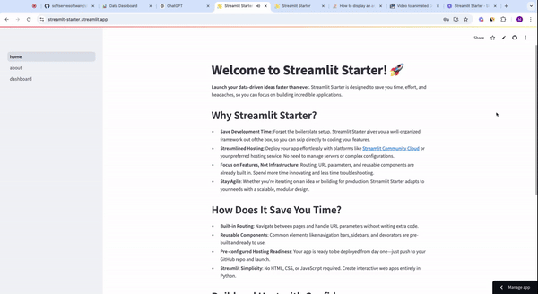

# Streamlit-Starter

A scalable, modular, and extensible boilerplate for building Streamlit applications with support for **routing**, **authentication**, and reusable **components**.



---

## Features

- **Modular Architecture**: Organized file structure for easy development and scaling.
- **Multi Page Support**: Navigate between pages using routes (ie `/dasboard`) and protect them as needed with authentication
- **Authentication**: Quick and simple authentication with oauth providers (e.g., google, microsoft, etc.)
- **Reusable Components**: Centralized reusable component examples (footers, widgets, etc.)
- **Decorators**: Easily add authentication, data manipulation, and other reusable logic.
- **Custom Styling**: Support for custom CSS through the `static/styles.css`.


---

## Directory Structure

```plaintext
streamlit_app/
├── home.py                 # Main entry point for the Streamlit app
├── pages/
│   ├── about.py            # About page logic
│   ├── dashboard.py        # Dashboard logic
├── components/
│   ├── footer.py           # Reusable Footer component
├── utils/
│   ├── authentication.py   # Decorators for auth (is_logged_in, protect_route, etc.)
├── static/
│   ├── data_example.csv    # Example dataset for dashboard
│   ├── matt.webp           # Example image
├── .streamlit/
│   ├── auth_config.yaml    # Authentication settings (oauth,users, etc.)
│   ├── config.toml         # Streamlit configs (env vars, secrets, etc.)
└── requirements.txt        # Python dependencies
```

---

## Installation

1. Clone the repository:
   ```bash
   git clone https://github.com/yourusername/streamlit-starter.git
   cd streamlit-starter
   ```

2. Install dependencies:
   ```bash
   python3 -m venv venv
   source venv/bin/activate
   pip install -r requirements.txt
   ```

3. Run the app:
   ```bash
   streamlit run home.py
   ```

---

## Usage

### Adding New Pages
1. Create a new file under `pages/` (e.g., `example.py`).
2. Add a `render()` function in the new page file:
   ```python
   import streamlit as st
   from utils.authentication import login_required

   # optional add the login required decorator
   @login_required
   def render():
       st.title("Example Page")
       st.write("Content for your new page.")
   render()
   ```

### Custom Decorators
- Add reusable decorators in `utils/` for tasks like authentication or logging. These can be reused across your application to achieve common tasks such as protecting certain pages behind authentication.
   ```python
   def login_required(func):
    """Decorator for requiring authentication."""

      @wraps(func)
      def wrapper(*args, **kwargs):
         authenticator = stauth.Authenticate(
               config["credentials"],
               config["cookie"]["name"],
               config["cookie"]["key"],
               config["cookie"]["expiry_days"],
         )
         if not st.session_state["authentication_status"]:
               st.error("You must log in to access this page.")
               authenticator.login()
               st.stop()
         else:
               authenticator.logout()
               return func(*args, **kwargs)

      return wrapper
   ```

### Styling
- Add custom CSS to `static/styles.css` and include it in the app:
   ```python
   st.markdown('<style>' + open('static/styles.css').read() + '</style>', unsafe_allow_html=True)
   ```

---

## Contributing
Changes, new ideas, and improvements are welcome! Please ensure that the following steps are taken when contributing.

1. Fork the repository.
2. Create a new branch:
   ```bash
   git checkout -b feature/new-feature
   ```
3. Commit your changes:
   ```bash
   git commit -m "Add new feature"
   ```
4. Push to your branch:
   ```bash
   git push origin feature/new-feature
   ```
5. Submit a pull request.

---

## License

This project is licensed under the MIT License. See the [LICENSE](LICENSE) file for details.

---

## Author

[Softserve Software LLC](https://softservsoftware.com)  
Feel free to reach out for suggestions, improvements, or general feedback!

---

Happy Streamlit-ing! 🚀